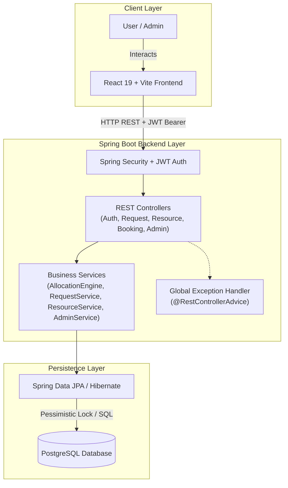
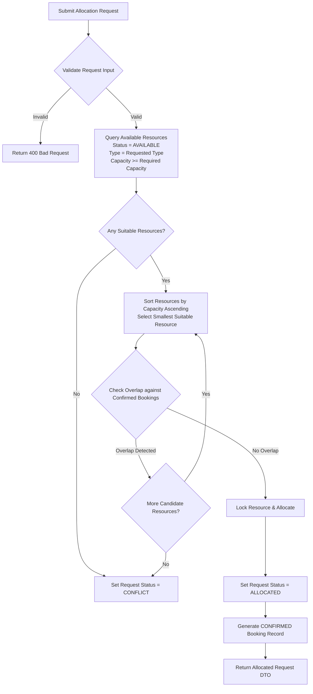
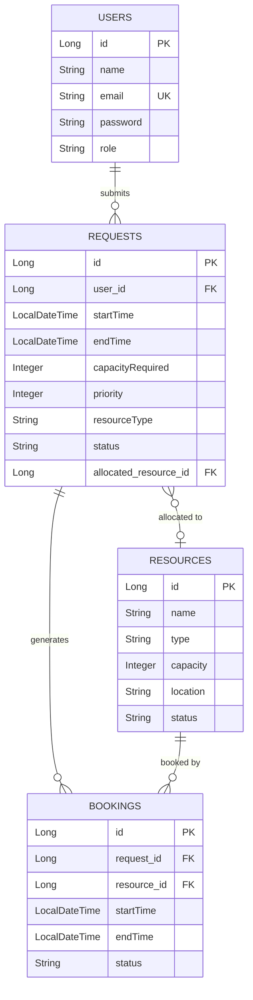

# OptiAlloc

OptiAlloc is a secure full-stack resource allocation and scheduling system that automatically assigns suitable resources while preventing scheduling conflicts.

---

## 1. Project Overview

Resource allocation in organizations (such as booking conference rooms, lab equipment, or compute nodes) is notoriously challenging due to capacity mismatch, time-overlap conflicts, and manual administrative overhead. 

**OptiAlloc** solves this problem by automating the allocation workflow:
* **Automated Best-Fit Engine**: Matches requests to available resources based on type, capacity, and time window while minimizing capacity wastage.
* **Conflict Prevention**: Evaluates exact time overlaps and prevents double-booking using database-level pessimistic locking.
* **Role-Based Workflows**: Provides distinct interfaces and privileges for regular users (**USER**) and administrators (**ADMIN**).

### Role Distinction

| Role | Access & Capabilities |
|---|---|
| **USER** | Register/Login, submit resource allocation requests, view personal request history, view assigned booking allocations. |
| **ADMIN** | Full resource CRUD management (create, update, status change, delete), view system-wide statistics, inspect all user requests. |

---

## 2. Key Features

### Authentication & Security
* **JWT Authentication**: Stateless authentication using JSON Web Tokens.
* **BCrypt Password Hashing**: Passwords stored securely using standard BCrypt encryption.
* **Role-Based Access Control (RBAC)**: Enforced via Spring Security (`USER` vs `ADMIN`).
* **User Ownership Isolation**: Server-side checks ensure users can only access their own requests and bookings.

### Resource Management
* **Resource Properties**: Name, Type (e.g., `LAB_EQUIPMENT`, `CONFERENCE_ROOM`), Capacity, Location, and Status.
* **Administrative Statuses**: `AVAILABLE`, `MAINTENANCE`, `DECOMMISSIONED`.
* **Admin Control**: Restricted creation, modification, and deletion endpoints for administrative control.

### Request Management
* **Request Lifecycle**: `PENDING` $\rightarrow$ `ALLOCATED` or `CONFLICT`.
* **Request Validation**: Enforces valid date ranges, positive capacity, valid priority levels (1–4), and required resource types.
* **History Tracking**: Users can view their personal request submission history and allocation outcomes.

### Allocation Engine
* **Type & Capacity Matching**: Filters resources by requested type and minimum capacity requirement.
* **Best-Fit Selection**: Sorts matching resources by capacity ascending to select the smallest suitable resource.
* **Time-Overlap Detection**: Checks existing confirmed bookings to prevent double-booking.
* **Back-to-Back Booking Support**: Boundary touching (e.g., 09:00–10:00 and 10:00–11:00) is recognized as valid non-overlapping time slots.
* **Pessimistic Locking**: Uses `@Lock(LockModeType.PESSIMISTIC_WRITE)` during allocation execution to handle concurrent requests safely.

### Booking System
* **Automated Confirmation**: Creating a successful allocation automatically generates a `CONFIRMED` booking record.
* **Booking Ownership**: Linked to both the original user request and the assigned physical resource.

### Admin Dashboard & Oversight
* **System Metrics**: Aggregate statistics including total resources, total requests, pending requests, allocated requests, and conflict counts.
* **Global Oversight**: Read-only view of all requests across all users in the system.

### Centralized Error Handling & Validation
* **Structured Response**: Standardized `ErrorResponse` model (`status`, `error`, `message`, `path`, `timestamp`).
* **Global Exception Advice**: Handled by `@RestControllerAdvice` covering validation errors, authentication failures, access denials, and domain-specific conflicts.

### API Documentation & Testing
* **Interactive Documentation**: Integrated OpenAPI 3.0 / Swagger UI.
* **Automated Testing**: 47 backend integration & regression tests with 0 failures, 0 errors, and 0 skipped.

---

## 3. System Architecture



---

## 4. Allocation Engine Flow



---

## 5. Best-Fit Selection & Overlap Logic

### Best-Fit Selection Strategy
When multiple resources satisfy a request's type and capacity requirements, OptiAlloc selects the candidate with the **smallest sufficient capacity**.

#### Example
* **Requested Capacity**: `30`
* **Available Resources**:
  * Resource A (Capacity: `100`)
  * Resource B (Capacity: `40`)
  * Resource C (Capacity: `30`)

**Selected Resource**: **Resource C** (Capacity `30`).  
*Rationale*: Reserving Resource C preserves larger resources (B and A) for future higher-capacity requests, reducing unnecessary capacity fragmentation across the system.

---

### Time-Overlap Logic

Two time intervals $[S_1, E_1)$ and $[S_2, E_2)$ **conflict** if and only if:

$$\text{existing.startTime} < \text{requested.endTime} \quad \text{AND} \quad \text{existing.endTime} > \text{requested.startTime}$$

#### Boundary & Overlap Examples

```
Scenario 1: Non-overlapping / Back-to-Back (ALLOWED)
Existing:  |=== 09:00 - 10:00 ===|
New:                             |=== 10:00 - 11:00 ===|
Result:    NO CONFLICT (touching at boundary 10:00 is permitted)

Scenario 2: Overlapping Interval (CONFLICT)
Existing:  |=== 09:00 - 10:00 ===|
New:                 |=== 09:30 - 10:30 ===|
Result:    CONFLICT DETECTED
```

---

## 6. Concurrency Control

To prevent concurrent allocation requests from double-booking the same physical resource, OptiAlloc enforces **database-level pessimistic write locking**:

```java
@Lock(LockModeType.PESSIMISTIC_WRITE)
@Query("SELECT r FROM Resource r WHERE r.id = :id")
Optional<Resource> findByIdForUpdate(@Param("id") Long id);
```

During execution within `@Transactional` boundary:
1. The target resource row is locked (`SELECT ... FOR UPDATE`).
2. Overlap validation evaluates existing confirmed bookings.
3. If valid, the booking is saved and committed atomically.
4. Concurrent transactions attempting to allocate the same resource wait until the lock is released, preventing race conditions.

---

## 7. Database Entity Relationship Diagram (ERD)



---

## 8. Technology Stack

| Component | Technology | Description |
|---|---|---|
| **Frontend Framework** | React 19 + Vite | SPA framework with React Router v7 & Axios |
| **Backend Framework** | Spring Boot 4.1.1 | Enterprise Java REST framework |
| **Language** | Java 21 / JavaScript ES6+ | Modern Java runtime & modern Web standards |
| **Database** | PostgreSQL | Relational database with transactional ACID guarantees |
| **Security Framework** | Spring Security 6 | Security filter chain and RBAC management |
| **Authentication** | JWT (`jjwt` 0.12.6) | Stateless token-based authentication |
| **Password Encoding** | BCrypt | Strong salted password hashing algorithm |
| **API Documentation** | Swagger UI / OpenAPI 3.0 | `springdoc-openapi-starter-webmvc-ui` 2.8.5 |
| **Build Automation** | Maven (Backend) / Vite (Frontend) | Dependency management & bundling |
| **Testing** | JUnit 5, Spring Boot Test | Automated unit, security, and integration testing |

---

## 9. Project Directory Structure

```
OptiAlloc/
├── backend/
│   ├── src/
│   │   ├── main/
│   │   │   ├── java/com/optialloc/backend/
│   │   │   │   ├── config/          # OpenApiConfig, SecurityConfig, DataInitializer
│   │   │   │   ├── controller/      # AuthController, RequestController, ResourceController, BookingController, AdminController
│   │   │   │   ├── dto/             # AuthDTOs, RequestDTOs, ResourceDTOs, AdminStatsDTO, ErrorResponse
│   │   │   │   ├── entity/          # User, Resource, Request, Booking
│   │   │   │   ├── exception/       # GlobalExceptionHandler, Custom Exception classes
│   │   │   │   ├── repository/      # UserRepository, ResourceRepository, RequestRepository, BookingRepository
│   │   │   │   ├── security/        # JwtTokenProvider, JwtAuthenticationFilter, UserDetailsService
│   │   │   │   ├── service/         # AllocationService, ResourceService, RequestService, AdminService
│   │   │   │   └── status/          # RequestStatus, ResourceStatus
│   │   │   └── resources/
│   │   │       └── application.properties
│   │   └── test/                    # 47 Automated Test Classes
│   └── pom.xml
├── frontend/
│   ├── src/
│   │   ├── components/              # Navigation, ProtectedRoute, Modals
│   │   ├── pages/                   # UserDashboard, AdminDashboard, AdminResourcesPage, AdminRequestsPage, LoginPage, RegisterPage
│   │   ├── services/                # Axios API Client & Interceptors
│   │   └── App.jsx
│   ├── package.json
│   └── vite.config.js
└── README.md
```

---

## 10. API Reference Overview

Complete interactive documentation with schema models is available at runtime via **Swagger UI** (`http://localhost:8080/swagger-ui/index.html`).

### Endpoint Summary Table

| Category | HTTP Method | Endpoint | Authorization | Description |
|---|---|---|---|---|
| **Auth** | `POST` | `/api/auth/register` | Public | Register a new user |
| **Auth** | `POST` | `/api/auth/login` | Public | Authenticate user & obtain JWT token |
| **Requests** | `POST` | `/api/requests` | `USER` / `ADMIN` | Create a new allocation request |
| **Requests** | `GET` | `/api/requests` | `USER` / `ADMIN` | Retrieve logged-in user's requests |
| **Requests** | `GET` | `/api/requests/{id}` | `USER` / `ADMIN` | Get request details by ID (ownership protected) |
| **Requests** | `POST` | `/api/requests/{id}/allocate` | `USER` / `ADMIN` | Trigger allocation execution for request |
| **Resources**| `GET` | `/api/resources` | `USER` / `ADMIN` | List available system resources |
| **Resources**| `GET` | `/api/resources/{id}` | `USER` / `ADMIN` | Get specific resource details |
| **Resources**| `POST` | `/api/resources` | `ADMIN` | Create new resource |
| **Resources**| `PUT` | `/api/resources/{id}` | `ADMIN` | Update existing resource |
| **Resources**| `DELETE` | `/api/resources/{id}` | `ADMIN` | Delete resource by ID |
| **Bookings** | `GET` | `/api/bookings` | `USER` / `ADMIN` | Retrieve logged-in user's confirmed bookings |
| **Admin** | `GET` | `/api/admin/stats` | `ADMIN` | Fetch aggregate system metrics |
| **Admin** | `GET` | `/api/admin/requests` | `ADMIN` | List all system requests across all users |

---

## 11. Interactive OpenAPI / Swagger Documentation

When the backend application is running, API endpoints and schemas can be explored interactively:

* **Swagger UI Web Interface**: [http://localhost:8080/swagger-ui/index.html](http://localhost:8080/swagger-ui/index.html)
* **OpenAPI v3 JSON Document**: [http://localhost:8080/v3/api-docs](http://localhost:8080/v3/api-docs)

To test protected endpoints within Swagger UI:
1. Execute `POST /api/auth/login` to receive a valid JWT token string.
2. Click the **Authorize** button at the top right of the Swagger UI.
3. Paste the JWT token into the `bearerAuth` field and click **Authorize**.

---

## 12. Setup & Installation Instructions

### Prerequisites
* **Java Development Kit (JDK)**: Java 21 or higher
* **Node.js**: Node.js 18+ and `npm`
* **PostgreSQL Database Server**: Running locally or remotely
* **Git**: Installed for version control

---

### Configuration Setup

Configure environment variables or update `backend/src/main/resources/application.properties`:

```bash
# Database Configuration
OPTIALLOC_DB_URL=jdbc:postgresql://localhost:5432/optialloc
OPTIALLOC_DB_USERNAME=your_db_username
OPTIALLOC_DB_PASSWORD=your_db_password

# Security Configuration
OPTIALLOC_JWT_SECRET=YourSuperSecretKeyForJWTTokenSigningMinimum256Bits
```

---

### Starting the Backend Application

```bash
# Navigate to backend directory
cd backend

# Build and start Spring Boot application (Windows)
.\mvnw.cmd spring-boot:run

# Or on Linux / macOS:
# ./mvnw spring-boot:run
```
The backend server will start at `http://localhost:8080`.

---

### Starting the Frontend Application

```bash
# Navigate to frontend directory
cd frontend

# Install dependencies
npm install

# Start Vite development server
npm run dev
```
The frontend application will start at `http://localhost:5173`.

---

## 13. Automated Testing Verification Results

### Backend Test Execution
Run all backend integration, unit, and regression tests using the Maven wrapper:

```bash
cd backend
.\mvnw.cmd clean test
```

#### Test Results Output
```text
[INFO] Results:
[INFO] 
[INFO] Tests run: 47, Failures: 0, Errors: 0, Skipped: 0
[INFO] 
[INFO] ------------------------------------------------------------------------
[INFO] BUILD SUCCESS
[INFO] ------------------------------------------------------------------------
```

### Frontend Production Build
Validate the frontend bundling process:

```bash
cd frontend
npm run build
```

#### Build Output
```text
vite v8.3.0 building client environment for production...
transforming...
✓ 90 modules transformed.
rendering chunks...
dist/index.html                   0.45 kB
dist/assets/index-C1m0BMsj.css   17.13 kB
dist/assets/index-CX7NzHIk.js   362.44 kB
✓ built in 729ms
```

---

## 14. Security Guidelines

* **Stateless Token Management**: Authentication tokens expire automatically and do not require server-side session storage.
* **Role Enforcement**: Endpoint safety is guarded at the method level using `@PreAuthorize("hasRole('ADMIN')")`.
* **Server-Side User Isolation**: Authenticated user identity is resolved directly from the JWT claims in Security Context, preventing client-side `userId` spoofing.
* **Zero Credential Exposure**: Sensitive credentials (passwords, JWT secrets) are excluded from log outputs and environment configuration placeholders are utilized.

---

## 15. Architectural & Design Decisions

1. **Why PostgreSQL?**  
   Provides strict ACID transactional guarantees necessary for accurate booking states and pessimistic locking capabilities.

2. **Why JWT Authentication?**  
   Enables stateless horizontal scalability without forcing shared session stores between frontend and backend services.

3. **Why Best-Fit Allocation Strategy?**  
   Selecting the smallest suitable resource preserves high-capacity resources for larger upcoming requests, maximizing system efficiency.

4. **Why Pessimistic Locking?**  
   Prevents double-booking race conditions when concurrent allocation requests target the same resource simultaneously.

5. **Why Separate Resource Status vs. Request Lifecycle Status?**  
   Decouples administrative asset maintenance (`AVAILABLE`, `MAINTENANCE`) from dynamic request processing states (`PENDING`, `ALLOCATED`, `CONFLICT`).

---

## 16. Recommended Screenshots Placeholder

*Visual demonstrations of the application interface can be added below:*

* **Login & Authentication**: User login screen with JWT credentials verification.
* **User Dashboard**: Main landing page showing active requests and personal stats.
* **Allocation Request Modal**: Form for creating new resource allocation requests.
* **My Allocations Page**: Detailed view of confirmed bookings and resource assignments.
* **Admin Dashboard**: System-wide oversight metrics and request distribution charts.
* **Admin Resource Management**: Management table for creating, updating, and disabling resources.
* **Swagger UI Portal**: Interactive OpenAPI documentation page.

---

## 17. Portfolio & Resume Highlights

* **Full-Stack Resource Engine**: Designed and implemented an end-to-end resource allocation system using Spring Boot 4, React 19, and PostgreSQL.
* **Algorithmic Best-Fit Allocation**: Engineered a conflict-free allocation engine featuring time-overlap detection, boundary touching support, and capacity optimization.
* **Concurrency Protection**: Integrated PostgreSQL pessimistic locking (`PESSIMISTIC_WRITE`) to ensure zero double-booking under concurrent request loads.
* **Robust Enterprise Security**: Implemented JWT stateless authentication, BCrypt password hashing, and server-side RBAC with strict ownership isolation.
* **Comprehensive Test Suite**: Built and verified a suite of 47 automated tests covering security, authorization, concurrent allocation, and edge cases.
